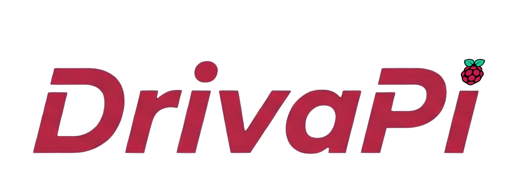
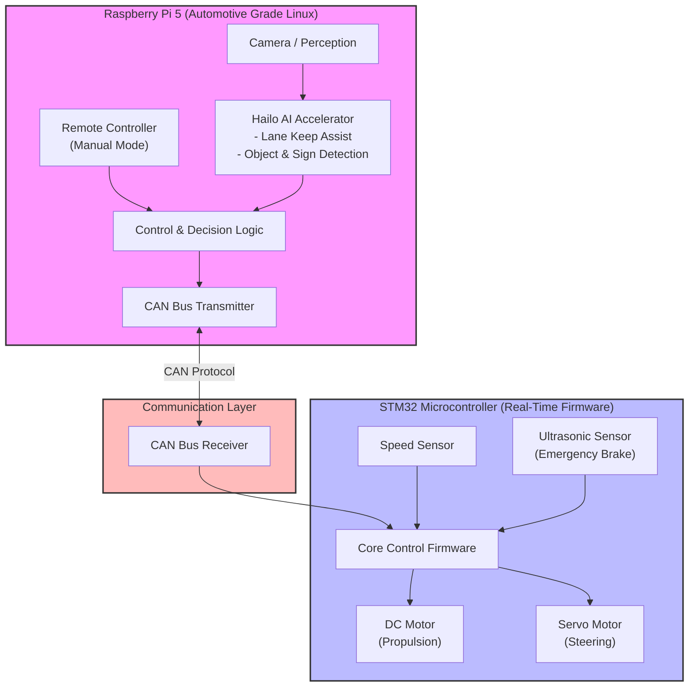

<p align="center">
  
</p>

<p align="center">
  <a href="https://github.com/SEAME-pt/Team04_DrivaPi/actions/workflows/unit_tests.yml">
    
  </a>
  <a href="https://github.com/SEAME-pt/Team04_DrivaPi/actions/workflows/tsf_validation.yml">
    
  </a>
  <a href="https://github.com/SEAME-pt/Team04_DrivaPi/actions/workflows/firmware_static.yml">
    
  </a>
</p>

# SEAME Automotive Journey

Autonomous vehicle platform developed using PiRacer as part of the SEAME Automotive Program.

<p align="center">
  <a href="https://github.com/user-attachments/assets/936b89e9-0787-454b-b90c-a8ffa02f6ebc">
    
  </a>
</p>


---

## 🚀 Quick Start

```bash
git clone git@github.com:SEAME-pt/Team04_DrivaPi.git
cd Team04_DrivaPi

# Build firmware
./firmware/build_and_flash.sh build

# Run unit tests
./tests/unit/run_all_tests.sh
```
---

## 🎯 What We're Building

- Computer vision and autonomous driving
- Real-time control systems (ThreadX RTOS)
- Qt-based interface
- Automotive industry standard architecture
- **Requirements management with TSF**

**Platform:** PiRacer with Raspberry Pi 5

---

## 🛠️ Tech Stack

| Category | Technology |
|----------|------------|
| **OS** | Automotive Grade Linux (AGL) |
| **RTOS** | ThreadX |
| **Language** | C++ (+ Rust evaluation) |
| **GUI** | Qt framework |
| **Requirements** | TSF (Trustable Software Framework) |
| **Standards** | ISO 26262 |

---

## 📁 Repository Structure

```
.
├── ADAS/                  # Advanced Driver Assistance Systems & perception logic
├── archive/               # Historical work and legacy files
├── docs/                  # Comprehensive project documentation
│   ├── CI/                # Continuous integration configurations & guides
│   ├── data-transfer/     # Protocol and data exchange documentation
│   ├── genAI/             # AI-assisted development notes and prompts
│   ├── hardware/          # PiRacer assembly, schematics, and hardware specs
│   ├── obstacle-detection/# Collision avoidance and sensing design
│   ├── presentations/     # Team slide decks and milestone reviews
│   ├── software/          # Software architecture and guidelines
│   ├── sprints/           # Sprint planning logs and retrospectives
│   ├── standards/         # ISO 26262 compliance and safety manuals
│   ├── standups/          # Daily stand-up meeting logs
│   ├── TSF/               # TSF workflow and theory guides
│   └── verification-toolchain/# Verification and test tools reference
├── dotstop/               # TSF traceability graph configurations
├── firmware/              # STM32 ThreadX RTOS real-time control code & build scripts
├── meta-cross/            # Cross-compilation and Automotive Grade Linux build tools
├── rust/                  # Rust component evaluations and implementations
├── scripts/               # Automation, setup, and deployment shell scripts
├── tests/                 # Unit, integration, and system test suites
└── TSF/                   # Trustable Software Framework (Requirements & Artifacts)
```
---

## 📐 System Architecture


---

## 🔨 Building & Flashing the STM32 Firmware

The firmware build script can be run from the repository root:

```bash
./firmware/build_and_flash.sh <command>
```

Available commands:

| Command | Description |
|---------|-------------|
| `build` | Build the firmware and generate the `.bin` file. |
| `flash` | Flash the existing firmware binary to the STM32. |
| `deploy` | Build the firmware and flash it to the STM32. |
| `clean` | Remove build artifacts and the generated binary. |

Examples:

```bash
# Build the firmware
./firmware/build_and_flash.sh build

# Build and flash the firmware
./firmware/build_and_flash.sh deploy
```

Running the script without any arguments displays the available commands and their usage:

```bash
./firmware/build_and_flash.sh
```
---

## 🧪 Unit Testing & Quality Gates

The repository includes a **Master Unit Test Automation Script** that runs all component unit tests, aggregates code coverage, and generates standardized test reports for CI/CD validation.

### How to Run

Execute the master test runner from the root of your repository:

    ./tests/unit/run_all_tests.sh

### What It Does

1. **Executes Component Test Suites:** Automatically runs individual test scripts for:
   - **DC Motor** (`tests/unit/dc-motor/`)
   - **Servo Motor** (`tests/unit/servo-motor/`)
   - **Speed Sensor** (`tests/unit/speed-sensor/`)
2. **Aggregates Code Coverage:** Collects and merges gcov coverage filters across all subsystems.
3. **Enforces Quality Gates:** Validates that all test suites pass successfully. Exits with status `0` on full success or `1` if any test fails.

### What It Generates

All reports and verification artifacts are automatically outputted to **`artifacts/verification/`**:

| Path | Description |
| :--- | :--- |
| **`artifacts/verification/tests/junit_results.xml`** | Merged JUnit XML test report (used by CI/CD pipelines). |
| **`artifacts/verification/tests/summary.json`** | JSON summary file containing individual test statuses and timestamps. |
| **`artifacts/verification/tests/`** | Individual component XML reports (`dc-motor.xml`, `servo-motor.xml`, `speed-sensor.xml`). |
| **`artifacts/verification/coverage/`** | Aggregated code coverage XML and info reports for quality analysis. |
---

## 📋 TSF Documentation

| Doc | When to Use | Time |
|-----|-------------|------|
| **[start.md](docs/TSF/start.md)** | First time, setup | 15 min |
| **[reference.md](docs/TSF/reference.md)** | Cheat sheet, commands | Reference |
| **[workflow.md](docs/TSF/workflow.md)** | Create requirements, review | Reference |
| **[training.md](docs/TSF/training.md)** | Understand TSF/ISO 26262 theory | 1-2h |
| **[evidence.md](docs/TSF/evidence.md)** | Link artifacts | Reference |

---

## 👥 Team Practices

### Daily Stand-Ups

- **Morning:** Quick sync (~10 min)
- **Facilitator:** Melanie
- **Docs:** [docs/standups/](docs/standups/)

### Agile/Scrum Process

- **Sprint Duration:** 2 weeks
- **Sprint Planning:** Start of each sprint
- **Sprint Review:** End of sprint demo
- **Sprint Retrospective:** Continuous improvement
- **Project Board:** GitHub Projects with automated workflows
- **Issue Tracking:** GitHub Issues linked to requirements

### Code Review Standards

- **Minimum Approvals:** 2 required for merge
- **Review Checklist:**
  - Code follows naming conventions
  - Tests pass locally and in CI
  - Documentation updated
  - TSF requirements linked (if applicable)
  - No secrets or sensitive data
- **PR Template:** Enforced via `.github/PULL_REQUEST_TEMPLATE.md`

### Quality Gates

All PRs must pass:
- Unit tests (90% coverage minimum)
- Static analysis (CodeQL)
- TSF validation
- 2 peer reviews

### Workflow

**Branch naming:** `<type>/<issue-number>-<description>`
- Types: `feat/`, `fix/`, `docs/`, `test/`, `refactor/`, `chore/`, `spike/`
- Example: `feat/316-integrate-unit-test-coverage`

**Development Process:**
1. **Start Work**: Create/assign GitHub issue → Move to "In Progress"
2. **Create Branch**: `git checkout -b <type>/<issue-number>-<description>`
3. **Develop**: Implement changes, write tests, update documentation
4. **TSF Integration** (if applicable):
   - Create/update requirements in `TSF/requirements/`
   - Link evidence to requirements
   - Validate with CI/CD pipeline
5. **Local Testing**: Run unit tests, static analysis locally
6. **Push & PR**: 
   - Push to GitHub
   - Create Pull Request using template
   - Link issue with "closes #<issue-number>"
7. **Review**: Minimum **2 approvals** required
8. **CI/CD Validation**:
   - Unit tests (`unit_tests.yml`)
   - Static analysis (`firmware_static.yml`)
   - TSF validation (`tsf_validation.yml`)
   - Doxygen documentation (`doxygen_documentation.yml`)
9. **Merge**: Squash and merge → Delete feature branch

**Commit format:** `<type>(<scope>): <description>`
- Types: `feat`, `fix`, `docs`, `test`, `refactor`, `chore`, `ci`, `revert`
- Scopes: `reqs`, `tsf`, `firmware`, `qt-app`, `ci`, `hardware`, etc.
- Examples:
  - `feat(reqs): add motor control requirements`
  - `fix(firmware): correct servo calibration logic`
  - `docs(tsf): update workflow documentation`
  - `test(unit): add speed sensor test coverage`
 
---

## 📊 Traceability Status

**TSF Framework:** Fully operational with automated validation

### Requirements Structure
- **URD** (User Requirements): L0 level requirements from product backlog
- **SRD** (System Requirements): L1 level system decomposition
- **SWD** (Software Design): L2 level detailed design
- **LLTC** (Low-Level Test Cases): L3 level unit/integration tests

### Automated CI/CD Pipeline
- ✅ Unit tests with code coverage (90% minimum)
- ✅ Static analysis with CodeQL
- ✅ TSF validation and traceability checks
- ✅ Automated evidence generation and linking
- ✅ Doxygen documentation generation

### Current Coverage
- Motor control requirements fully traced
- Servo control requirements fully traced
- Speed sensor unit tests implemented
- Automated traceability updates via CI

**View detailed report:** [TSF/artifacts/trustable-report/dashboard.md](TSF/artifacts/trustable-report/dashboard.md)

---

## 📚 Standards Compliance

- **ISO 26262:** Functional safety
  - ASIL levels assigned
  - Hazard analysis
  - V-Model development

- **TSF:** Trustable Software Framework
  - Requirements traceability
  - Evidence-based trust
  - Git audit trail

---

## 👤 Team Roles

| Member | Primary Focus | Responsibilities |
|--------|--------------|------------------|
| **Bernardo** | Hardware Integration & Testing | PiRacer integration, hardware validation, system testing |
| **Gaspar** | OS & Development Environment | AGL setup, build systems, cross-compilation, toolchain |
| **Hugo** | Hardware & Fabrication | Mechanical design, 3D printing, custom parts, assembly |
| **Melanie** | GUI & Team Coordination | Qt application, HMI design, stand-up facilitation, documentation |
| **Miguel** | GitHub Project & Agile/Scrum | Project management, GitHub workflows, sprint planning, CI/CD |

---

## 📜 License

Educational project - SEAME Automotive Program

---
