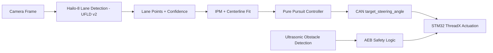

# Research Report: Lane Keep Assist (LKA) System Architecture

**Platform:** Raspberry Pi 5 + Hailo-8 Neural Processing Unit (NPU) + PiRacer (STM32/ThreadX)  
**Project:** SEA:ME

---

## 1. Executive Summary
This document consolidates the technical research for a Lane Keep Assist (LKA) Minimum Viable Product (MVP).
The selected architecture uses **Hailo-8** for low-latency lane perception on Raspberry Pi 5 and **ThreadX Real-Time Operating System (RTOS)** on STM32 for deterministic actuation and safety override (Emergency Braking (AEB)).

### 1.1 MVP Goal
Keep the vehicle centered in lane at low-to-medium speed on a controlled track, with fail-safe braking priority over steering commands.

### 1.2 Non-Goals (MVP)
- Full autonomy in urban traffic.
- Multi-lane behavior planning (lane changes, overtaking).
- End-to-end trajectory optimization with high-compute controllers (e.g., full MPC stack).

---

## 2. Prerequisites for Implementation
1. **Hailo-8 setup available and validated** on Raspberry Pi 5 (dependency: Issue #479).
2. **Camera calibration inputs** available (mounting height, pitch, intrinsic matrix if available).
3. **Controller Area Network (CAN) interface baseline** defined between Automotive Grade Linux (AGL) and STM32 (baud rate, message IDs, timeout behavior).
4. **ThreadX safety hooks** available for AEB override and command watchdog.
5. **Simulation baseline in CARLA** prepared for closed-loop LKA tests before physical runs.

## 3. Perception: Lane Detection Models
We evaluated three model families that are realistic for Hailo-8 deployment and embedded post-processing constraints.

### 3.1 Model Comparison
| Model | Primary Method | Top Strength | Main Trade-off |
| :--- | :--- | :--- | :--- |
| **UFLD v2** | Row-selection | **Speed (300+ Frames Per Second (FPS))**; Minimal latency. | Lower precision in sharp 90° curves. |
| **YOLOP** | Panoptic | **Multi-tasking**: Detects lanes + obstacles. | High Central Processing Unit (CPU) load for post-processing. |
| **LaneATT** | Anchor-based | **Accuracy**: Robust against shadows. | Complex anchor calibration for Raspberry Pi. |

**Selected Model for MVP:** **UFLD v2**.

### 3.2 Selection Rationale
- The control loop benefits more from consistent low latency than peak segmentation quality.
- UFLD v2 leaves Central Processing Unit (CPU) headroom for filtering, CAN communication, and diagnostics.
- Simpler post-processing reduces integration risk and tuning complexity.

### 3.3 Expected Perception Output
Per frame, the perception module publishes:
- Left and right lane boundary points in image coordinates.
- Confidence score for each detected lane.
- Derived lane centerline points for controller input.

---

## 4. Mathematical Approach: From Pixels to Steering
The transformation pipeline converts raw camera frames into physical steering angles.

### 4.1 Inverse Perspective Mapping (IPM)
To reduce perspective distortion and approximate ground-plane geometry, we apply a homography matrix $H$:
$$
\begin{bmatrix} x_{bev} \\ y_{bev} \\ 1 \end{bmatrix} = H \cdot \begin{bmatrix} u \\ v \\ 1 \end{bmatrix}
$$
where $(u, v)$ are image pixels and $(x_{bev}, y_{bev})$ are bird's-eye-view coordinates.

### 4.2 Path Fitting
Detected centerline points are fitted to a second-order polynomial:
$$
f(x) = Ax^2 + Bx + C
$$
- **A (Curvature):** Defines the turn intensity.
- **C (Lateral Offset):** Distance from the center of the lane.

### 4.3 Control Law: Pure Pursuit
We compute the steering command $\delta$ by targeting a look-ahead point:
$$
\delta = \arctan\left(\frac{2L\sin(\alpha)}{L_{fd}}\right)
$$
- $L$: Wheelbase of the PiRacer.
- $L_{fd}$: Look-ahead distance (tuning parameter).
- $\alpha$: Angle to the target point.

To reduce oscillation, $L_{fd}$ should increase with speed within bounded limits.

---

## 5. Control Theory: Algorithm Evaluation
| Algorithm | Pros | Cons |
| :--- | :--- | :--- |
| **Pure Pursuit** | **Highly Stable**; robust to sensor noise. | Tends to cut corners in sharp turns. |
| **Stanley** | **Superior Accuracy**; eliminates lateral error. | Sensitive to noisy lane detection (jitter). |
| **MPC** | **Optimal**; accounts for vehicle physics. | Very high computational cost for Raspberry Pi 5. |

**Selected Algorithm:** **Pure Pursuit** due to its stability on small-scale robotic platforms.

### 5.1 Why Not Stanley or MPC for MVP
- **Stanley** can outperform Pure Pursuit on precise centerline tracking, but it is more sensitive to noisy lane estimates.
- **MPC** is attractive for long-term roadmap work, but current compute budget and integration time favor a simpler controller.

---

## 6. System Integration & Safety
The architecture ensures a fail-safe design by separating perception from safety-critical actuation.

- **AGL (Linux/Raspberry Pi 5):** Handles AI inference (Hailo-8) and path planning.
- **CAN Bus:** Transmits `target_steering_angle` to the STM32.
- **ThreadX (RTOS):** Receives CAN commands and performs **Emergency Braking (AEB)** using ultrasonic sensors if an obstacle is detected, overriding LKA.

### 6.1 Control and Safety Priority
1. LKA computes steering setpoint from lane geometry.
2. STM32 validates command bounds and command freshness.
3. AEB logic has highest priority and can override throttle/steering behavior according to safety policy.

### 6.2 Interface Proposal (Initial)
- CAN message: `target_steering_angle`
- Recommended fields: `timestamp_ms`, `angle_deg`, `confidence`, `alive_counter`
- Failsafe condition: if timeout or confidence below threshold, transition to neutral steering strategy and reduced speed.

### 6.3 Data Flow Diagram

---

## 7. Performance Targets (MVP)
- End-to-end perception-to-command latency: **<= 60 ms**
- Controller update rate: **>= 20 Hz**
- Mean lateral error on test track: **<= 0.20 m**
- No unsafe oscillation under nominal lighting and marked-lane conditions

These are engineering targets for validation and can be adjusted after first hardware runs.

---

## 8. Implementation Roadmap
1. **Calibration:** Generate JSON profiles for different manual camera heights.
2. **Model Optimization:** Convert UFLD v2 to `.hef` format using the Hailo Dataflow Compiler.
3. **Middleware:** Finalize CAN message IDs for steering and speed control.
4. **Simulation Validation:** Validate closed-loop behavior in **CARLA** before physical deployment.
5. **Hardware Tuning:** Tune $L_{fd}$ and filtering parameters on physical track.
6. **Safety Validation:** Verify AEB override behavior under timeout and obstacle scenarios.

---

## 9. Risks and Mitigations
- **Risk:** Lane dropouts under shadows or worn markings.  
	**Mitigation:** Confidence gating + temporal smoothing + conservative fallback behavior.
- **Risk:** CAN delay/jitter causing stale steering commands.  
	**Mitigation:** Timestamp checks, alive counters, and timeout-based neutral control.
- **Risk:** Over-aggressive steering in tight curves.  
	**Mitigation:** Speed-adaptive look-ahead and steering-rate limiting on STM32.

---

## 10. Validation Steps
1. Open this research document and verify LKA concept, selected model, and control law are clearly described.
2. Confirm the architecture and data flow from perception to STM32 are explicit and consistent.
3. Validate that implementation prerequisites and roadmap steps are actionable for development teams.
4. Review performance targets and risks to ensure they are measurable and useful for future test planning.
