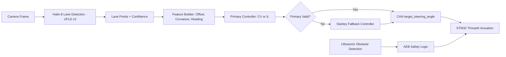

# Research Report: Lane Keep Assist (LKA) System Architecture

**Platform:** Raspberry Pi 5 + Hailo-8 Neural Processing Unit (NPU) + PiRacer (STM32/ThreadX)  
**Project:** SEA:ME

---

## 1. Executive Summary
This document consolidates the technical research for a Lane Keep Assist (LKA) Minimum Viable Product (MVP).
The selected architecture uses a **modular stack**: **Hailo-8** for low-latency lane perception, a pluggable lateral controller on Raspberry Pi 5, and **ThreadX Real-Time Operating System (RTOS)** on STM32 for deterministic actuation and safety override (Emergency Braking (AEB)).

### 1.1 MVP Goal
Keep the vehicle centered in lane at low-to-medium speed on a controlled track, with fail-safe braking priority over steering commands.


### 1.2 Non-Goals (MVP)
- Full autonomy in urban traffic.
- Multi-lane behavior planning (lane changes, overtaking).
- End-to-end perception-to-control policy learning for the complete LKA loop.

---

## 2. Prerequisites for Implementation
1. **Hailo-8 setup available and validated** on Raspberry Pi 5 (dependency: Issue #479).
2. **Camera calibration inputs** available (mounting height, pitch, intrinsic matrix if available).
3. **Controller Area Network (CAN) interface baseline** defined between Automotive Grade Linux (AGL) and STM32 (baud rate, message IDs, timeout behavior).
4. **ThreadX safety hooks** available for AEB override and command watchdog.
5. **Simulation baseline in CARLA** prepared for closed-loop LKA tests before physical runs.

## 3. Perception: Lane Detection Models
We evaluated three model families that are realistic for Hailo-8 deployment and embedded post-processing constraints.

### 3.1 Model Comparison
| Model | Primary Method | Top Strength | Main Trade-off |
| :--- | :--- | :--- | :--- |
| **UFLD v2** | Row-selection | **Speed (300+ Frames Per Second (FPS))**; Minimal latency. | Lower precision in sharp 90° curves. |
| **YOLOP** | Panoptic | **Multi-tasking**: Detects lanes + obstacles. | High Central Processing Unit (CPU) load for post-processing. |
| **LaneATT** | Anchor-based | **Accuracy**: Robust against shadows. | Complex anchor calibration for Raspberry Pi. |

**Selected Model for MVP:** **UFLD v2**.

### 3.2 Selection Rationale
- The control loop benefits more from consistent low latency than peak segmentation quality.
- UFLD v2 leaves Central Processing Unit (CPU) headroom for filtering, CAN communication, and diagnostics.
- Simpler post-processing reduces integration risk and tuning complexity.

### 3.3 Expected Perception Output
Per frame, the perception module publishes:
- Left and right lane boundary points in image coordinates.
- Confidence score for each detected lane.
- Derived lane centerline points for controller input.

---

## 4. Mathematical Approach: From Pixels to Steering
The transformation pipeline converts raw camera frames into physical steering angles.

### 4.1 Inverse Perspective Mapping (IPM)
To reduce perspective distortion and approximate ground-plane geometry, we apply a homography matrix $H$:
```math
\begin{bmatrix} x_{bev} \\ y_{bev} \\ 1 \end{bmatrix} = H \cdot \begin{bmatrix} u \\ v \\ 1 \end{bmatrix}
```
where $(u, v)$ are image pixels and $(x_{bev}, y_{bev})$ are bird's-eye-view coordinates.

### 4.2 Path Fitting
Detected centerline points are fitted to a second-order polynomial:
```math
f(x) = Ax^2 + Bx + C
```
- **A (Curvature):** Defines the turn intensity.
- **C (Lateral Offset):** Distance from the center of the lane.

### 4.3 Computer Vision (CV) Control Branch
In the geometric branch, we compute steering from lane geometry using a model-based controller.
For the Stanley method, the steering command can be expressed as:
```math
\delta = \psi_e + \arctan\left(\frac{k e_c}{v + \epsilon}\right)
```
- $\psi_e$: Heading error.
- $e_c$: Cross-track error.
- $k$: Stanley gain.
- $v$: Vehicle speed.
- $\epsilon$: Small term to avoid division by zero.

### 4.4 Machine Learning (ML) Control Branch
In the learning branch, an **Imitation Learning (IL)** policy maps perception features (lane points, offset, heading cues, confidence) to steering commands.
This branch is trained from expert trajectories and remains modular from perception so each module can be validated independently.

---

## 5. Control Theory: Algorithm Evaluation
| Algorithm | Pros | Cons |
| :--- | :--- | :--- |
| **CV Geometric Controller (Stanley candidate)** | Interpretable; deterministic; easy to bound for safety. | Sensitive to lane-noise and calibration drift. |
| **ML Imitation Learning (IL)** | Captures human-like behavior; can smooth control in complex curvature. | Requires quality dataset and strict runtime monitoring. |
| **Stanley Fallback Mode** | Strong recovery behavior under degraded main-control confidence. | Needs robust switching logic to avoid control chattering. |

**Selected Approach:** **Modular hybrid control**.
- Primary controller: **CV** or **ML (IL)** branch under evaluation.
- Safety fallback controller: **Stanley** when main LKA control is invalid or low-confidence.

### 5.1 Fallback Trigger Conditions (Initial)
- Lane confidence below threshold for `N` consecutive frames.
- Perception timeout or stale controller input.
- Steering command out of bounds or unstable command variance.

---

## 6. System Integration & Safety
The architecture ensures a fail-safe design by separating perception from safety-critical actuation.

- **AGL (Linux/Raspberry Pi 5):** Handles AI inference (Hailo-8) and path planning.
- **CAN Bus:** Transmits `target_steering_angle` to the STM32.
- **ThreadX (RTOS):** Receives CAN commands and performs **Emergency Braking (AEB)** using ultrasonic sensors if an obstacle is detected, overriding LKA.

### 6.1 Control and Safety Priority
1. LKA computes steering setpoint using primary controller (CV or IL).
2. STM32 validates command bounds and command freshness.
3. If primary controller validity fails, switch to Stanley fallback mode.
4. AEB logic has highest priority and can override throttle/steering behavior according to safety policy.

### 6.2 Interface Proposal (Initial)
- CAN message: `target_steering_angle`
- Recommended fields: `timestamp_ms`, `angle_deg`, `confidence`, `alive_counter`
- Failsafe condition: if timeout or confidence below threshold, transition to Stanley fallback and reduced speed.

### 6.3 Data Flow Diagram


---

## 7. Performance Targets (MVP)
- End-to-end perception-to-command latency: **<= 60 ms**
- Controller update rate: **>= 20 Hz**
- No unsafe oscillation under nominal lighting and marked-lane conditions

Definitions:
- **Mean lateral error:** Arithmetic average of absolute lateral offset from lane center over the full run.
- **P95 lateral error:** Value below which 95% of absolute lateral offset samples fall.

### 7.1 Lateral Error Targets by Development Phase
Given the measured geometry (vehicle width: ~0.21 m, lane width: ~0.325 m), lateral targets are defined in phases:

- **Phase 1 (initial bring-up):**
	- Mean lateral error: **<= 0.04 m**
	- P95 lateral error: **<= 0.06 m**
- **Phase 2 (stabilized tuning):**
	- Mean lateral error: **<= 0.03 m**
	- P95 lateral error: **<= 0.05 m**
- **Phase 3 (mature closed-loop behavior):**
	- Mean lateral error: **<= 0.02 m**
	- P95 lateral error: **<= 0.04 m**
	- Hard bound (max lateral error): **<= 0.055 m**

These are engineering targets for validation and can be tightened after repeated hardware runs.

---

## 8. Implementation Roadmap
1. **Calibration:** Generate JSON profiles for different manual camera heights.
2. **Model Optimization:** Convert UFLD v2 to `.hef` format using the Hailo Dataflow Compiler.
3. **Control Prototyping:** Implement both CV and IL controller interfaces behind a common API.
4. **Fallback Logic:** Implement Stanley fallback trigger conditions and hysteresis.
5. **Middleware:** Finalize CAN message IDs and validity/health fields for steering control.
6. **Simulation Validation:** Validate switching behavior and closed-loop tracking in **CARLA** before physical deployment.
7. **Hardware Tuning:** Tune Stanley gain, fallback thresholds, and IL confidence gates on physical track.
8. **Safety Validation:** Verify AEB and fallback interactions under timeout, dropout, and obstacle scenarios.

---

## 9. Risks and Mitigations
- **Risk:** Lane dropouts under shadows or worn markings.  
	**Mitigation:** Confidence gating + temporal smoothing + automatic Stanley fallback.
- **Risk:** CAN delay/jitter causing stale steering commands.  
	**Mitigation:** Timestamp checks, alive counters, and timeout-based neutral control.
- **Risk:** Controller switching instability (mode flapping).  
	**Mitigation:** Hysteresis, minimum dwell time per mode, and bounded steering-rate transitions.

---

## 10. Validation Steps
1. Open this research document and verify LKA concept, selected model, and control law are clearly described.
2. Confirm the architecture and data flow from perception to STM32 are explicit and consistent.
3. Validate that implementation prerequisites and roadmap steps are actionable for development teams.
4. Review performance targets and risks to ensure they are measurable and useful for future test planning.
