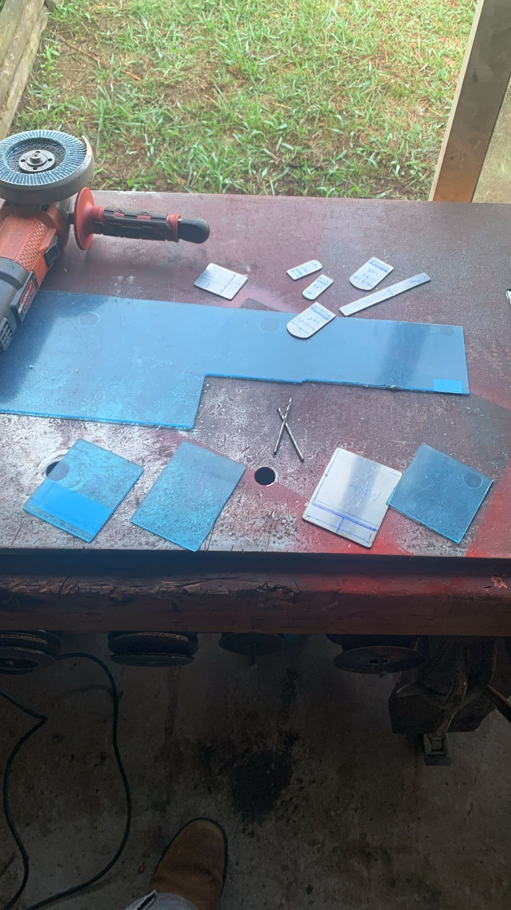
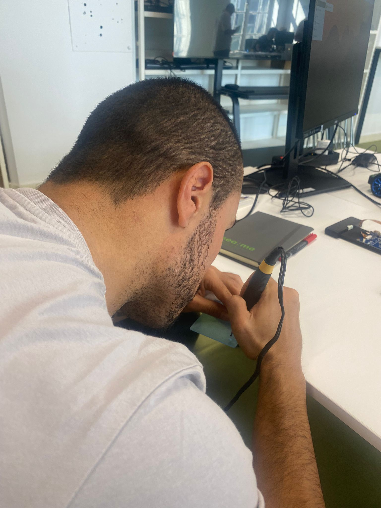
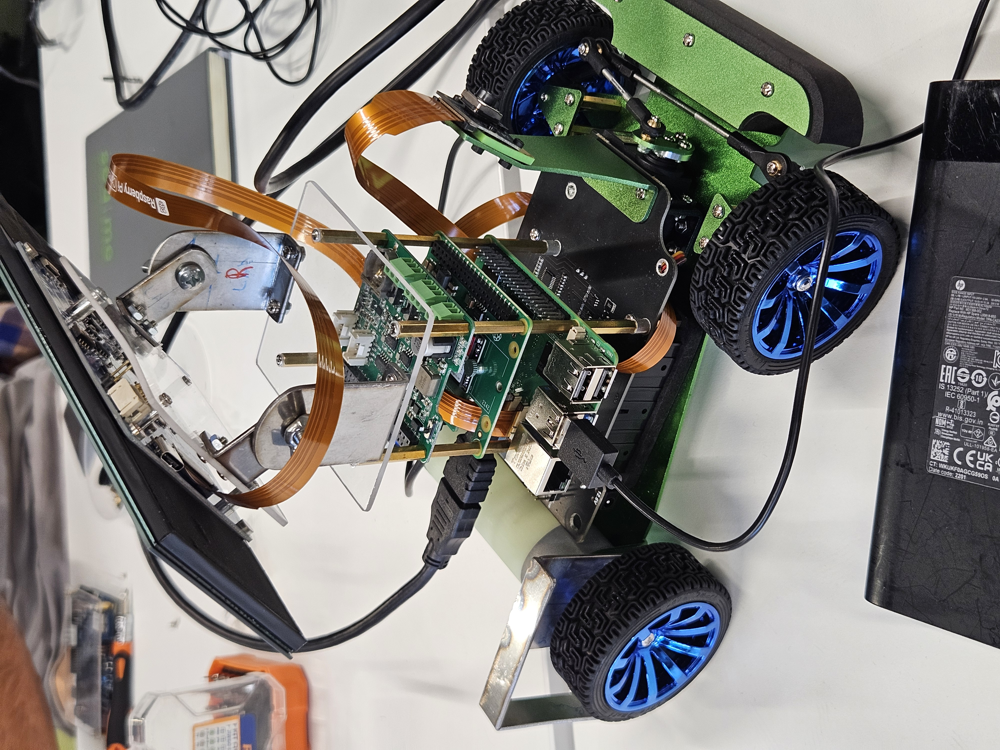
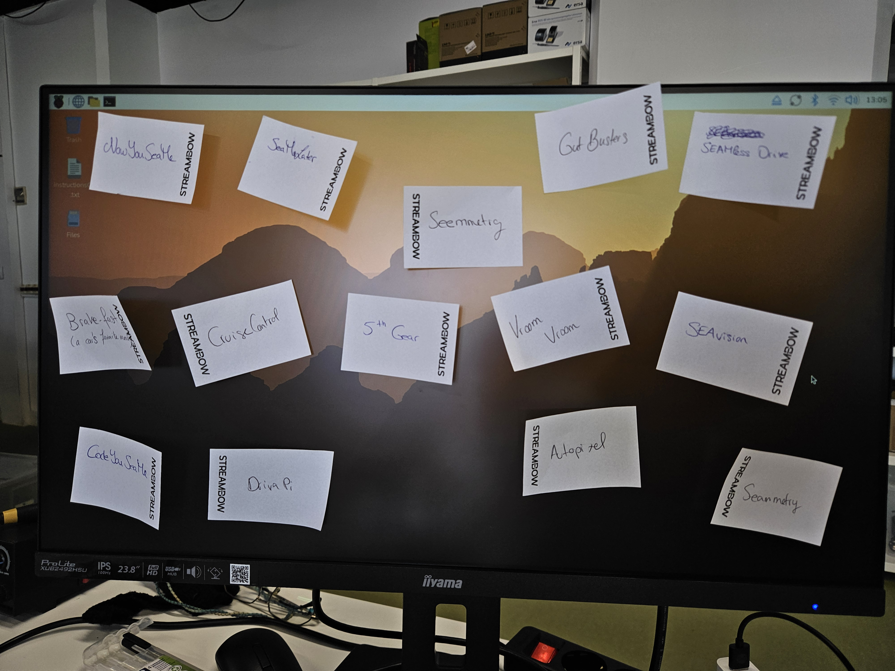

# Day 2 - SEAME Automotive Journey

**Date:** October 9, 2025

**Project:** PiRacer Autonomous Vehicle Platform

**Team:** Team04

## What We Did Today

We started by redifining our designs and Hugo made custom acrylic and steel supports for our boards and instrument cluster. That way, everything looks good and tidied up.

After that, we had a quick brainstorming session to pick the team name. We are now... DrivaPi !!

We also started our own GitHub Project to improve team/task management and have an Agile workflow following CI/CD best practices.

### Hardware Assembly
Metal and acrylic being cut to our needs:

Measuring and drilling the holes for the boards:

Finished custom build:

### Technical Challenges
Picking the OS for the Raspberry Pi 5. Right now, we have PiOS installed, but are looking into Linux Automotive.
Our custom-made pieces need some adjustments.

#### Software Architecture Decisions
We are still researching our technology stack options:

**Programming Language Choice:**
- **C++**: More mature toolchain, excellent Qt integration, industry standard in automotive
- **Rust**: Better memory safety, growing adoption in automotive, more future-oriented
- **Decision**: We'll prototype in both to compare them properly

**Real-Time Operating System:**
- **ThreadX (Azure RTOS)**: ISO 26262 certified for automotive safety, which is important
- **FreeRTOS**: Community-driven, lots of documentation, easier to get started
- **Plan**: Test both with LED control on STM32 to see which works better for our needs

**GUI Framework:**
- Qt looks like our best bet for the user interface - good cross-platform support and integrates well with our hardware

### Development Environment Planning
We need to set up several different environments:
- Raspberry Pi OS as our base system (might migrate to Automotive Grade Linux later)
- Qt Creator for GUI development
- Development tools for both ThreadX and FreeRTOS
- GitHub workflow for team collaboration (still waiting on access credentials)

### Name Picking
We quickly came up with a variety of different creative names for our team, effectively eliminating one by one, until only 3 remained.

### Eclipse SDV Integration Research
We also looked into how this fits with the broader Eclipse Software Defined Vehicle (SDV) framework:
- Service-oriented architecture approach
- AUTOSAR compliance considerations
- Vehicle-to-cloud connectivity using MQTT
- Container orchestration for scalable deployment

This is important because we want this to be more than just a one-off project - the goal is to build something that could scale to real automotive applications.

## Current Status and Challenges

**What's Working:**
- Hardware assembly is about 90% complete and on track
- Team collaboration is going really well
- We have a clear understanding of our technical requirements

**Challenges:**
- Speed sensor mounting needs will soon be mounted - custom metal plate needs adjustments.
- Multiple technology options to evaluate - don't want to get stuck in analysis paralysis
- GitHub team access still pending
- Slack workspace access still pending
- Lots of different development environments to set up

**Technical Decisions Pending:**
- Final programming language choice (C++ vs Rust)
- RTOS selection (ThreadX vs FreeRTOS)
- Timeline for migrating from Raspberry Pi OS to Automotive Grade Linux

## Standards and Compliance
We're keeping in mind several industry standards as we develop:
- ISO 26262 functional safety requirements
- AUTOSAR framework integration
- COVESA vehicle signal specifications
- Eclipse Foundation open-source methodologies

The goal is to build something that's not just a cool prototype, but actually follows automotive industry best practices.

Another productive day! With the car fully built we can finally start programming it!
