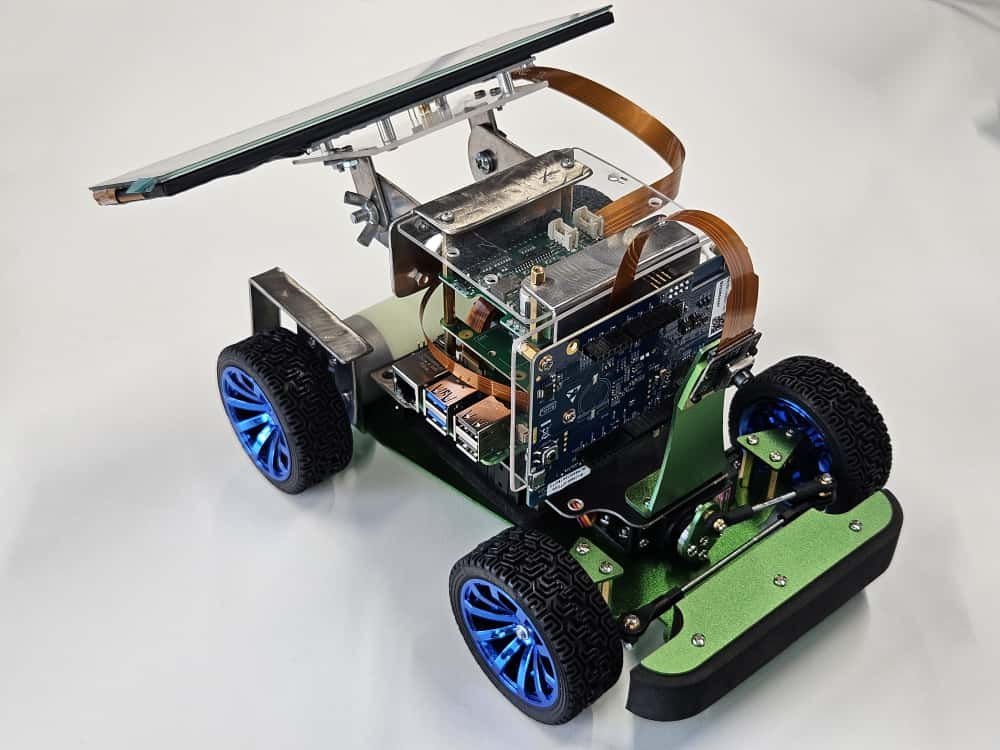
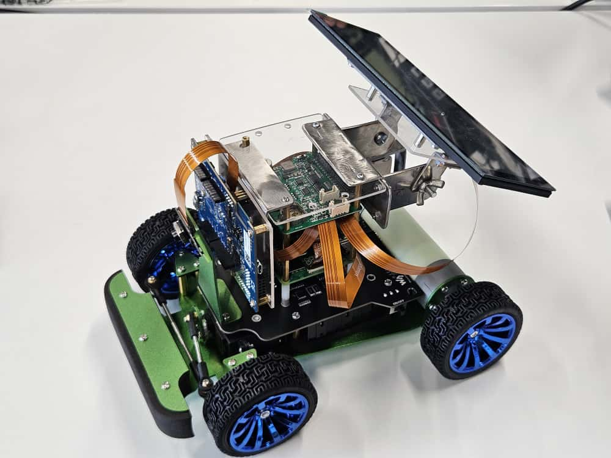
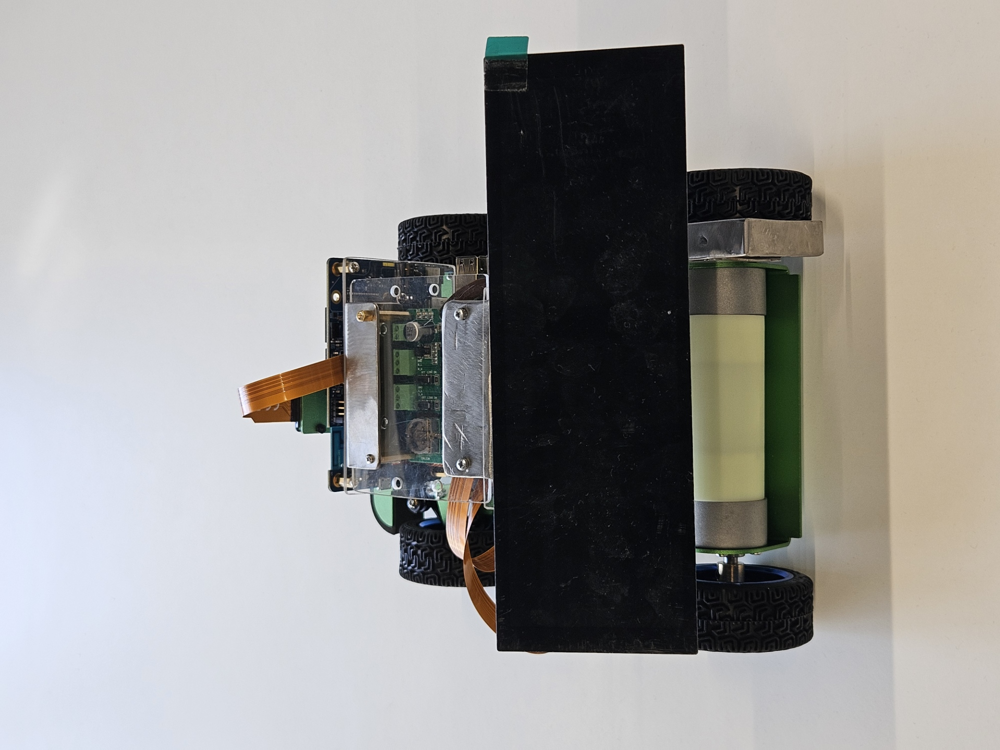
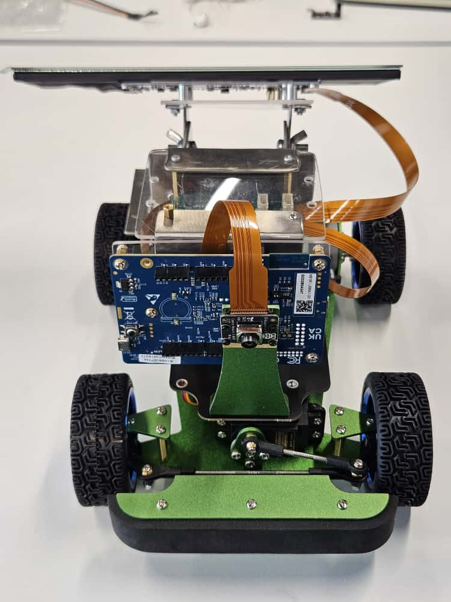

# Day 3 - SEAME Automotive Journey

**Date:** October 10, 2025

**Project:** PiRacer Autonomous Vehicle Platform

**Team:** DrivaPi (team04)

## What We Did Today

We initiated the next phase by revising our core designs. Hugo delivered critical hardware support by crafting custom acrylic and steel mounts for both the electronics boards and the instrument cluster. Concurrently, we established our software foundation by building a simple Qt-based application and structuring the primary GitHub repository. The OS installation remains the current focus for completion.

### Hardware Assembly

Finished custom build:

Different views of the car:

### Technical Challenges
We are currently encountering two critical technical challenges: the Automotive Grade Linux (AGL) installation is failing, and the display subsystem is not functioning as expected

#### Software Architecture Decisions
We are still researching our technology stack options:

**Programming Language Choice:**
- **C++**: More mature toolchain, excellent Qt integration, industry standard in automotive
- **Rust**: Better memory safety, growing adoption in automotive, more future-oriented
- **Decision**: We'll prototype in both to compare them properly

**Real-Time Operating System:**
We chose ThreadX as our Real-Time Operating System.

**GUI Framework:**
- Qt looks like our best bet for the user interface - good cross-platform support and integrates well with our hardware

### Development Environment Planning
We need to set up several different environments:
- Raspberry Pi OS as our base system (might migrate to Automotive Grade Linux later)
- Qt Creator for GUI development
- Development tools for both ThreadX and FreeRTOS
- GitHub workflow for team collaboration (still waiting on access credentials)

### Eclipse SDV Integration Research
We also looked into how this fits with the broader Eclipse Software Defined Vehicle (SDV) framework:
- Service-oriented architecture approach
- AUTOSAR compliance considerations
- Vehicle-to-cloud connectivity using MQTT
- Container orchestration for scalable deployment

This is important because we want this to be more than just a one-off project - the goal is to build something that could scale to real automotive applications.

## Current Status and Challenges

**What's Working:**
- Hardware assembly is about 90% complete
- Team collaboration is going really well
- We have a clear understanding of our technical requirements

**Challenges:**
- Speed sensor mounting needs will soon be mounted - custom metal plate needs adjustments.
- GitHub team access still pending
- Lots of different development environments to set up

**Technical Decisions Pending:**
- Timeline for migrating from Raspberry Pi OS to Automotive Grade Linux

## Standards and Compliance
We're keeping in mind several industry standards as we develop:
- ISO 26262 functional safety requirements
- AUTOSAR framework integration
- COVESA vehicle signal specifications
- Eclipse Foundation open-source methodologies

The build is locked in. Time to inject intelligence and compliance!
