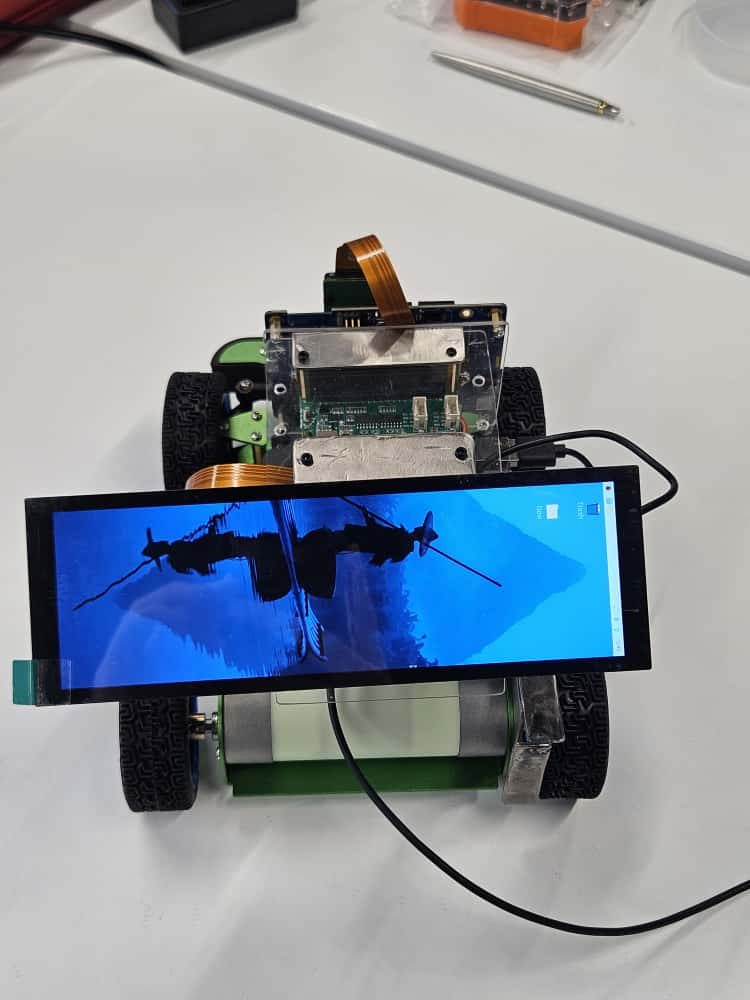
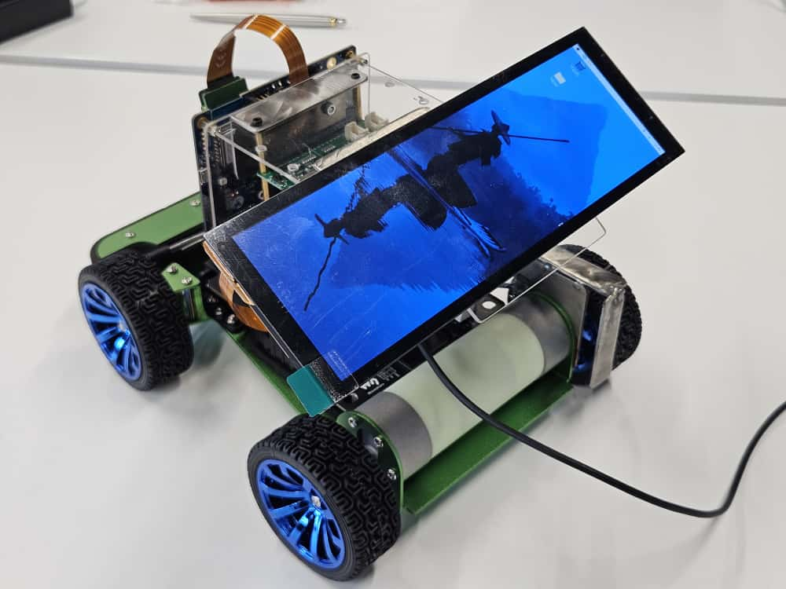
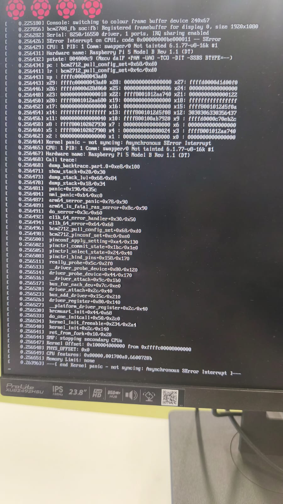
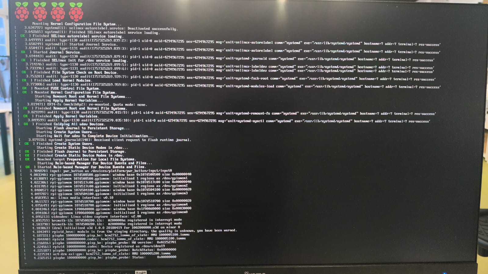

# Day 4 - SEAME Automotive Journey

**Date:** October 13, 2025

**Team:** Hugo, Gaspar, Bernardo, Miguel, Melanie (DrivaPi)

**Stand-Up:** [📋 standups/2025-10-13.md](2025-10-13.md)

---

## What We Did Today

We made significant progress across both hardware and software aspects. The 3D model for the speed sensor was finalised, the display (cluster) is now working, and a basic GUI was developed using Qt (cu-te).

Additionally, progress was made on the AGL build and GitHub project organisation. We also held our first planning meeting, receiving positive feedback on our weekly progress.

---

## Team Progress

### Hugo - Hardware & Fabrication
- ✅ Finished the 3D model for the speed sensor, and the display configuration.
- 🔄 Preparing for sensor printing and mounting.

### Gaspar - OS & Development Environment
- ✅ Progressed on the build for Automotive Grade Linux (AGL).
- 🔄 Fixing errors on the AGL build.

### Bernardo - Hardware Integration & Testing
- ✅ Successfully connected and tested the display (cluster) on the Raspberry Pi.
- 🔄 Further testing and performance validation planned.

### Miguel - GitHub Project & Agile/Scrum
- ✅ Advanced the GitHub Projects board, improving organisation and task tracking.
- 🔄 Setting up workflow automation and progress metrics.

### Melanie - GUI & Team Coordination
- ✅ Developed a basic Qt application for the Raspberry Pi cluster display.
- 🔄 Planning interface improvements and integration with sensor data.

---

## Hardware

**Speed Sensor Progress and Display (Cluster):**

---

## Software

**AGL build:**

---

## Challenges

**Problem:** AGL installation
- **Who:** Gaspar
- **Impact:** Medium
- **Solution:** Checks if all files and configurations are correct

---

## Standards & Research

- Research the term Spikes.
- Investigate TSF GitHub DoorStop.
- Define a task goal phrase.

---

**Previous:** [october10.md](2025-10-10.md) | **Next:** [october14.md](2025-10-14.md)
